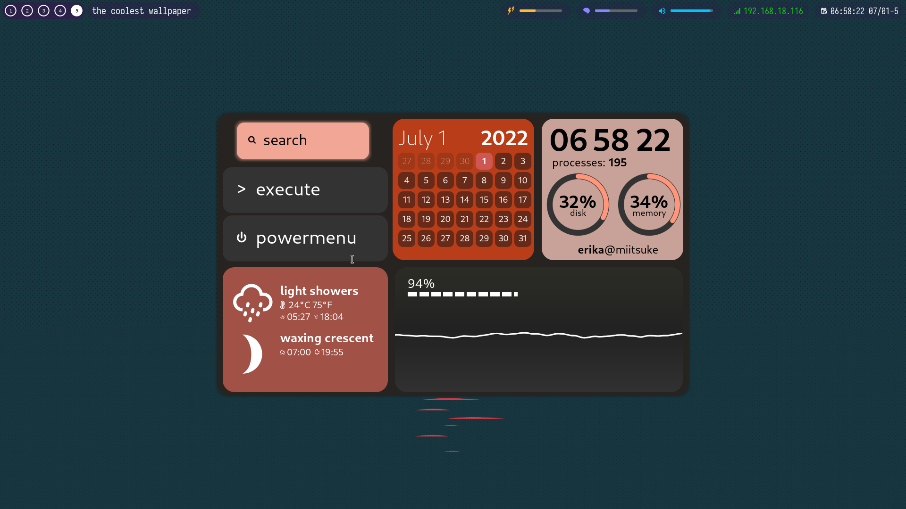

# unfluiid
*version 1 :)*



A rice where I reinvented the wheel (polybar, bar, eww, rofi, dunst, and maybe awesome) just for cool transitions. 

The code is mid messy, so forking will be a pain in the ass, so it's rather a showcase than something for a template to begin with. (It's better that I'll probably drop an API to make rices almost in Python or move to AwesomeWM)

## Installation
You'll need an i3wm/sway desktop environment, because it uses the i3ipc dependency for displaying the window titles and workspaces.

1. Install some fonts.
- [Iosevka Term Nerd Font Complete Mono](https://github.com/ryanoasis/nerd-fonts/blob/master/patched-fonts/Iosevka/Regular/complete/Iosevka%20Term%20Nerd%20Font%20Complete%20Mono.ttf)

2. Install some dependencies for some pip packages (some names will be different depending on your distro; in this case, below will be Arch Linux)
```
gtk3 portaudio cairo
```

3. Install pip packages
```
pip install -r requirements.txt
```

4. In your window manager's configs, bind those keybinds to launch unfluiid with the following options without giving a startup id:
- bar
- search
- dashboard
- powermenu
- screenflash (suitable for letting your desktop go on an suspended state)

Example:
`.../unfluiid bar`

If you also want to interact with your tray (which unfluiid doesn't mainly have), by configuration too, you can autolaunch the `launch.sh` in the `polybar_tray` folder.

### Known Issues
- The window title seems to overlap when on a screen resolution apparently smaller than 1920x1080, especially if you have many workspaces open.

- The workspaces section seems to freeze after an i3 configuration reload

- Search application requires the i3-sensible-terminal for lazy terminal application launching.

- Positioning issue when unicode characters are shown. (Can be done in the window title by just going to a website with CJK characters on the title)

- Sometimes the application just freezes (mostly due to an error outputting invisibly), access and log in to a tty (Ctrl+Fx, one of them should turn you back to your graphical environment), then run `killall unfluiid`, and then go back to your graphical environment.
